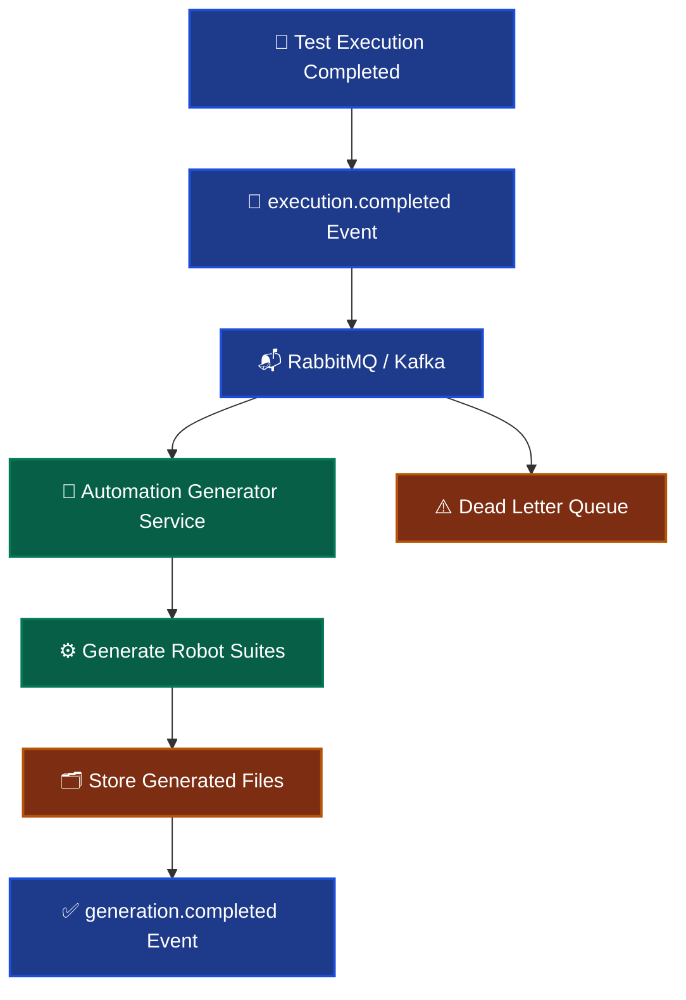
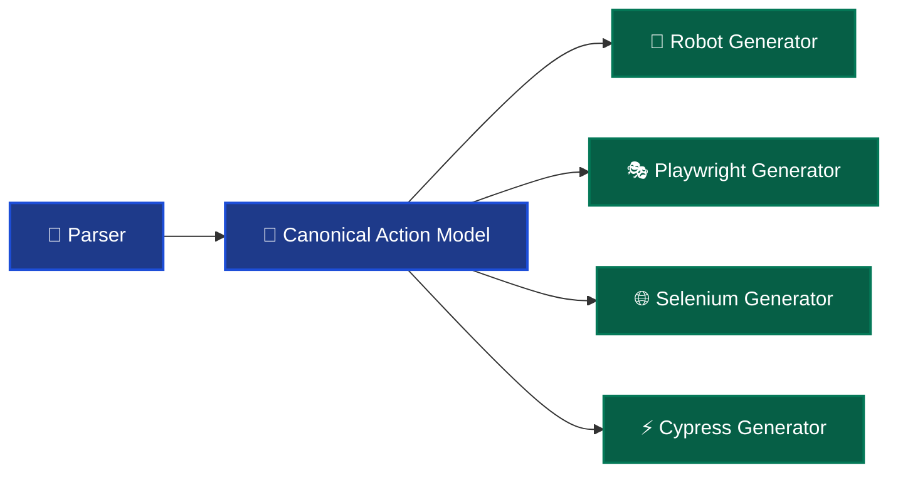

# MCP-to-Robot Enterprise Integration Implementation Plan

> Transforming `mcp-to-robot` from a CLI utility into an enterprise-grade automation synthesis platform.

---

# Table of Contents

1. Overview
2. Business Alignment
3. Current System Architecture
4. Target Enterprise Architecture
5. Service Responsibilities
6. Backend Transformation Roadmap
7. API Design
8. Project Structure
9. Metadata Persistence Layer
10. File Storage Strategy
11. Event-Driven Processing
12. Containerization & Deployment
13. Runtime Production Flow
14. Agent Integration Strategy
15. Canonical Action Model
16. Enterprise Enhancements
17. Scalability Considerations
18. Security & Reliability
19. Future Roadmap
20. Conclusion

---

# 1. Overview

`mcp-to-robot` is evolving from:

```text
CLI-based conversion utility
```

into:

```text
Enterprise Automation Generation Microservice
```

The platform’s core responsibility is:

```text
Execution Evidence
        ↓
Structured Automation Assets
```

This positions the repository as the:

# Automation Synthesis Layer

within a larger AI-driven QA ecosystem.

---

# 2. Business Alignment

The platform directly supports the following enterprise requirements:

| Requirement ID | Contribution                                            |
| -------------- | ------------------------------------------------------- |
| TMEX-B-02      | Automated script generation for regression/re-execution |
| TMEX-FR-07     | Automation agent generates test scripts                 |
| TMEX-FR-08     | Generated automation result output                      |
| TMEX-FR-11     | Automation analytics and cost avoidance tracking        |

---

# 3. Current System Architecture

## Existing Capability

```text
execution.log
raw.log
report.json
      ↓
mcp-to-robot
      ↓
Robot Framework Suites
```

## Current Internal Architecture

```text
Parser
Transformer
Generator
Validator
```

The current separation of concerns is already production-oriented and suitable for extraction into a reusable service architecture.

---

# 4. Target Enterprise Architecture

## High-Level System Architecture

```mermaid
flowchart LR

    %% =========================
    %% CLIENT / ORCHESTRATION
    %% =========================

    MCP["🧪 MCP Execution Platform"]
    ORCH["🤖 LLM Orchestrator / Agent"]
    ALM["📋 ALM-QC / Jira"]

    %% =========================
    %% STORAGE + EVENTS
    %% =========================

    STORE["🗂️ Artifact Storage<br/>(S3 / MinIO / Blob)"]
    MQ["📨 Event Queue<br/>(RabbitMQ / Kafka)"]

    %% =========================
    %% AUTOMATION GENERATION
    %% =========================

    API["🚀 Automation Generation API<br/>FastAPI"]

    subgraph ENGINE["⚙️ mcp-to-robot Engine"]
        PARSER["📖 Parser"]
        TRANSFORM["🔄 Transformer"]
        GENERATOR["🛠️ Generator"]
        VALIDATOR["✅ Validator"]
    end

    %% =========================
    %% OUTPUT SYSTEMS
    %% =========================

    REPO["📦 Test Script Repository"]
    EXEC["▶️ Regression Execution Engine"]
    DASH["📊 Analytics & Cost Dashboard"]
    DB["🗄️ PostgreSQL Metadata DB"]

    %% =========================
    %% FLOW
    %% =========================

    MCP --> STORE
    MCP --> MQ

    MQ --> ORCH
    ORCH --> API

    API --> PARSER
    PARSER --> TRANSFORM
    TRANSFORM --> GENERATOR
    GENERATOR --> VALIDATOR

    VALIDATOR --> REPO

    API --> DB

    REPO --> EXEC

    EXEC --> ALM
    EXEC --> DASH

    DASH --> DB

    %% =========================
    %% STYLING
    %% =========================

    classDef orchestration fill:#1E3A8A,color:#ffffff,stroke:#1E40AF,stroke-width:2px;
    classDef storage fill:#065F46,color:#ffffff,stroke:#047857,stroke-width:2px;
    classDef engine fill:#7C3AED,color:#ffffff,stroke:#6D28D9,stroke-width:2px;
    classDef output fill:#92400E,color:#ffffff,stroke:#B45309,stroke-width:2px;

    class MCP,ORCH,ALM orchestration;
    class STORE,MQ,DB storage;
    class API,PARSER,TRANSFORM,GENERATOR,VALIDATOR engine;
    class REPO,EXEC,DASH output;
```



---

# 5. Service Responsibilities

## Current State

```text
CLI Tool
```

## Target State

```text
Stateless Automation Generation Service
```

The service becomes callable by:

* LLM agents
* CI/CD systems
* Regression orchestration pipelines
* QA execution platforms
* Enterprise automation systems

---

# 6. Backend Transformation Roadmap

---

# Phase 1 — API Service Extraction

## Objective

Convert existing CLI functionality into reusable REST APIs.

---

## Recommended Technology Stack

| Layer            | Technology       |
| ---------------- | ---------------- |
| API Framework    | FastAPI          |
| Validation       | Pydantic         |
| ASGI Runtime     | Uvicorn          |
| ORM              | SQLAlchemy       |
| Database         | PostgreSQL       |
| Queue            | RabbitMQ / Kafka |
| Storage          | S3 / MinIO       |
| Containerization | Docker           |
| Orchestration    | Kubernetes       |

---

# 7. API Design

---

## Generate Automation Suite

### Endpoint

```http
POST /generate
```

---

## Request Payload

```json
{
  "execution_log_url": "s3://artifacts/execution.log",
  "raw_log_url": "s3://artifacts/raw.log",
  "report_url": "s3://artifacts/report.json",
  "execution_id": "exec_001",
  "framework": "robot"
}
```

---

## Response

```json
{
  "status": "completed",
  "suite_id": "suite_001",
  "robot_file_url": "s3://generated/login_tests.robot",
  "test_cases_generated": 12
}
```

---

## Suggested Additional Endpoints

| Endpoint                 | Purpose                       |
| ------------------------ | ----------------------------- |
| `POST /generate`         | Trigger suite generation      |
| `GET /executions/{id}`   | Retrieve execution metadata   |
| `GET /suites/{id}`       | Retrieve generated suite info |
| `GET /health`            | Health check endpoint         |
| `GET /metrics`           | Prometheus metrics            |
| `POST /events/execution` | Event ingestion endpoint      |
| `POST /validate`         | Validate generated suites     |
| `GET /artifacts/{id}`    | Retrieve artifact metadata    |

---

# 8. Suggested Project Structure

```text
src/
├── api/
│   ├── main.py
│   ├── routes.py
│   ├── schemas.py
│   └── service.py
│
├── parser/
├── transformer/
├── generator/
├── validator/
│
├── canonical/
│   ├── models.py
│   └── actions.py
│
├── db/
│   ├── models.py
│   ├── session.py
│   └── repository.py
│
├── queue/
│   ├── producer.py
│   └── consumer.py
│
├── storage/
│   └── s3_client.py
│
├── observability/
│   ├── logging.py
│   ├── tracing.py
│   └── metrics.py
│
├── config/
│   └── settings.py
│
└── cli.py
```

---

# 9. Metadata Persistence Layer

---

# PostgreSQL Schema Design

## executions

Tracks automation generation jobs.

```sql
CREATE TABLE executions (
    id UUID PRIMARY KEY,
    status VARCHAR(50),
    created_at TIMESTAMP,
    completed_at TIMESTAMP,
    triggered_by VARCHAR(255),
    framework VARCHAR(50)
);
```

---

## artifacts

Stores artifact metadata and storage locations.

```sql
CREATE TABLE artifacts (
    id UUID PRIMARY KEY,
    execution_id UUID REFERENCES executions(id),
    artifact_type VARCHAR(50),
    storage_url TEXT
);
```

### Artifact Types

* execution_log
* raw_log
* report_json

---

## generated_suites

Tracks generated automation outputs.

```sql
CREATE TABLE generated_suites (
    id UUID PRIMARY KEY,
    execution_id UUID REFERENCES executions(id),
    suite_name VARCHAR(255),
    framework VARCHAR(50),
    storage_url TEXT,
    validation_status VARCHAR(50)
);
```

---

## generated_test_cases

Stores generated scenarios.

```sql
CREATE TABLE generated_test_cases (
    id UUID PRIMARY KEY,
    suite_id UUID REFERENCES generated_suites(id),
    scenario_id VARCHAR(255),
    status VARCHAR(50)
);
```

---

# Recommended Additional Tables

## audit_logs

```sql
CREATE TABLE audit_logs (
    id UUID PRIMARY KEY,
    execution_id UUID,
    event_type VARCHAR(100),
    created_at TIMESTAMP,
    payload JSONB
);
```

---

## suite_versions

```sql
CREATE TABLE suite_versions (
    id UUID PRIMARY KEY,
    suite_id UUID,
    version INTEGER,
    created_at TIMESTAMP,
    storage_url TEXT
);
```

---

# 10. File Storage Strategy

## Important Design Principle

Do NOT store:

* execution logs
* raw logs
* generated robot files

inside PostgreSQL.

PostgreSQL should only store:

* metadata
* references
* relationships
* audit information
* storage URLs

---

## Recommended Storage Systems

| Platform   | Use Case         |
| ---------- | ---------------- |
| AWS S3     | Enterprise cloud |
| MinIO      | Self-hosted      |
| Azure Blob | Microsoft stack  |
| GCS        | Google Cloud     |

---

# Recommended Storage Layout

```text
/artifacts/{execution_id}/execution.log
/artifacts/{execution_id}/raw.log
/artifacts/{execution_id}/report.json

/generated/{execution_id}/robot/
generated/{execution_id}/playwright/
generated/{execution_id}/selenium/
```

---

# 11. Event-Driven Processing

## Recommended Architecture



---

## Example Event Payload

```json
{
  "event": "execution.completed",
  "execution_id": "exec_001",
  "artifact_urls": {
    "execution_log": "s3://...",
    "raw_log": "s3://...",
    "report_json": "s3://..."
  }
}
```

---

## Why Event-Driven Architecture Matters

### Without Queue

```text
Execution waits for generation
```

Problems:

* blocking
* poor scalability
* slower execution pipeline
* instability under heavy load

---

### With Queue

```text
Execution → async event → generation
```

Benefits:

* asynchronous processing
* retry support
* horizontal scalability
* fault tolerance
* better operational resilience
* enterprise compatibility

---

# 12. Containerization & Deployment

## Dockerfile

```dockerfile
FROM python:3.12

WORKDIR /app

COPY . .

RUN pip install -r requirements.txt

CMD ["uvicorn", "src.api.main:app", "--host", "0.0.0.0", "--port", "8000"]
```

---

## Kubernetes Deployment Target

Deploy as:

```text
mcp-to-robot-service
```

inside:

```text
Kubernetes Cluster
```

---

## Recommended Kubernetes Components

| Component               | Purpose                   |
| ----------------------- | ------------------------- |
| Deployment              | Stateless service runtime |
| Service                 | Internal networking       |
| Ingress                 | API gateway exposure      |
| HorizontalPodAutoscaler | Autoscaling               |
| ConfigMap               | Configuration management  |
| Secret                  | Credential management     |
| PersistentVolume        | Optional local storage    |

---

# 13. Runtime Production Flow

```text
1. MCP agent executes test

2. Execution artifacts uploaded to storage

3. execution.completed event emitted

4. Automation generation service triggered

5. Parser extracts Playwright actions

6. Transformer maps actions to canonical model

7. Generator produces Robot Framework suite

8. Validator validates syntax + duplication

9. Generated suite uploaded to repository

10. Regression engine schedules future runs

11. Dashboard updates metrics and analytics
```

---

# 14. Agent Integration Strategy

The platform becomes an AI-callable automation synthesis service.

## Example

```python
generate_automation_suite(
    execution_id,
    artifacts
)
```

---

# Responsibility Separation

## LLM Orchestrator Responsibilities

Responsible for:

* deciding whether generation should occur
* selecting target framework
* prioritization
* retry policies
* severity classification
* orchestration logic

---

## Automation Generation Service Responsibilities

Responsible for:

```text
artifact → automation conversion
```

This separation creates a clean, scalable architecture.

---

# 15. Canonical Action Model

---

# Current Mapping

```text
Playwright Pattern
        ↓
Robot Keyword
```

Example:

```text
getByRole(button).click()
→ Click
```

---

# Target Enterprise Model

Introduce a:

# Canonical Action Model

Example:

```python
Action(
    type="click",
    locator="text=Sign In"
)
```

---

# Multi-Framework Generation

```text
Canonical Action Model
        ↓
Multiple Generators
```

Supported outputs:

* Robot Framework
* Playwright
* Selenium
* Cypress

---

## Future Architecture



---

# 16. Enterprise Enhancements

## Recommended Features

### Retry Engine

Supports:

* transient failure retries
* parser recovery
* queue retry policies

---

### AI-Assisted Locator Repair

Automatically repair:

* unstable selectors
* changed DOM structures
* broken locators

---

### Semantic Deduplication

Prevents duplicate generated test cases.

---

### Versioned Test Suites

```text
Suite v1
Suite v2
Suite v3
```

---

### Audit Trail

Track:

* triggering user
* artifact origins
* timestamps
* execution lineage
* validation status

---

### Analytics Engine

Track:

* automation coverage
* cost avoidance
* execution frequency
* flaky test detection
* generation success rate

---

# 17. Scalability Considerations

## Stateless Service Design

The service should remain stateless to support:

* horizontal scaling
* rolling deployments
* fault isolation
* Kubernetes autoscaling

---

## Recommended Scaling Strategy

| Component       | Scaling Method         |
| --------------- | ---------------------- |
| API Layer       | Horizontal Pods        |
| Queue Consumers | Consumer Groups        |
| Storage         | Managed Object Storage |
| Database        | Read Replicas          |
| Cache           | Redis                  |

---

## Performance Optimizations

* async file downloads
* batch generation
* streaming artifact parsing
* incremental validation
* caching parsed actions

---

# 18. Security & Reliability

## Recommended Security Controls

### Authentication

* OAuth2
* JWT tokens
* API keys for internal services

---

### Authorization

Role-based access control (RBAC):

* admin
* orchestrator
* qa-engineer
* automation-service

---

### Storage Security

* signed URLs
* encryption at rest
* encryption in transit

---

### Reliability Controls

* retry policies
* dead letter queues
* circuit breakers
* timeout policies
* idempotent event processing

---

# 19. Future Roadmap

## Near-Term Goals

* FastAPI extraction
* PostgreSQL integration
* S3 integration
* RabbitMQ integration
* Docker deployment

---

## Mid-Term Goals

* Canonical action model
* Multi-framework generation
* Suite versioning
* Analytics platform

---

## Long-Term Goals

* AI-assisted test repair
* Autonomous regression optimization
* Self-healing automation
* Intelligent flaky test analysis
* Fully agentic QA workflows

---

# 20. Conclusion

`mcp-to-robot` is evolving into:

# Intelligent Automation Synthesis Infrastructure

Core transformation:

```text
Execution Evidence
        ↓
Reusable Automation Assets
```

This architecture addresses several major enterprise QA challenges:

* log-to-test conversion
* reusable regression generation
* framework abstraction
* automation acceleration
* semantic test reconstruction

The existing modular architecture already provides a strong foundation for scaling into a production-grade automation generation platform.
